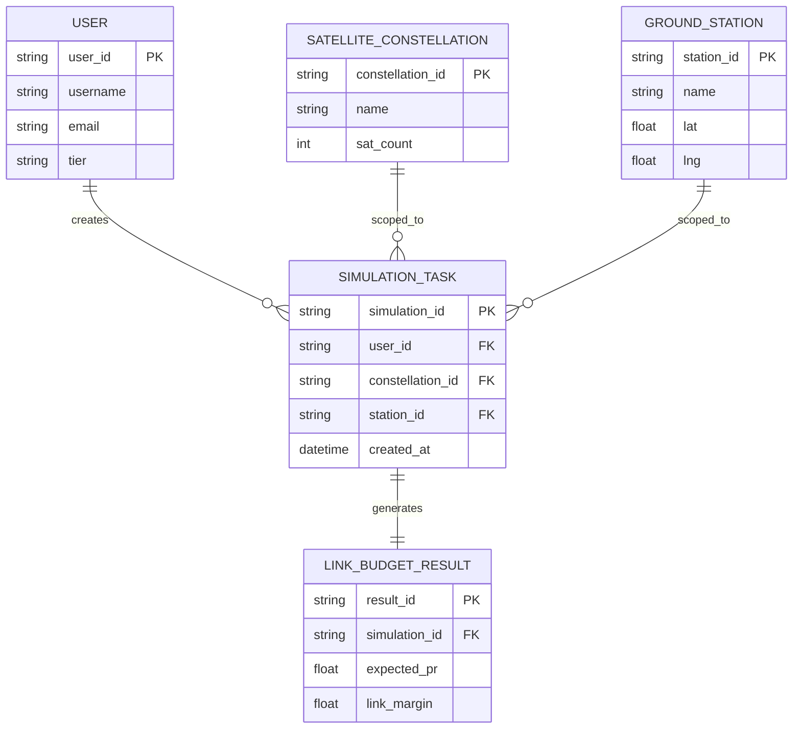

# Entity Relationship Diagram (ERD) Documentation: Palatine 2.0

## 1. Conceptual Data Model
The Palatine Next-Gen database is designed to handle high-frequency simulation data and user-specific configurations.

## 2. Entity Definitions

### 2.1 User
Represents the individuals or organizations using the platform.
- **Fields**: `user_id` (PK), `username`, `email`, `role`, `tier` (Free/Enterprise).

### 2.2 Satellite Constellation
Represents a group of satellites (e.g., Starlink, OneWeb).
- **Fields**: `constellation_id` (PK), `name`, `operator`, `sat_count`, `altitude`, `inclination`.

### 2.3 Ground Station
Represents the terrestrial receiving points.
- **Fields**: `station_id` (PK), `name`, `latitude`, `longitude`, `altitude`, `antenna_gain`.

### 2.4 Simulation Task
Records of simulated satellite passes and link budgets.
- **Fields**: `simulation_id` (PK), `user_id` (FK), `constellation_id` (FK), `station_id` (FK), `timestamp`, `duration_days`.

### 2.5 Link Budget Result
Detailed statistical outputs from the Monte Carlo simulations.
- **Fields**: `result_id` (PK), `simulation_id` (FK), `worst_case_pr`, `expected_pr`, `best_case_pr`, `link_margin`.

## 3. Relationships (Visual Representation)

